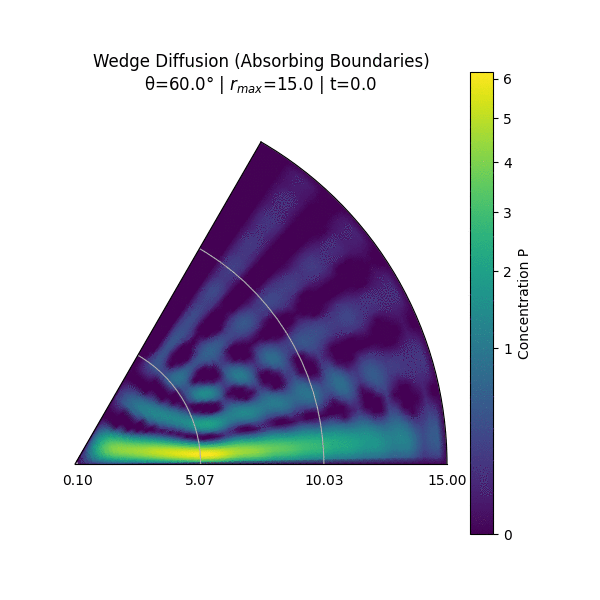
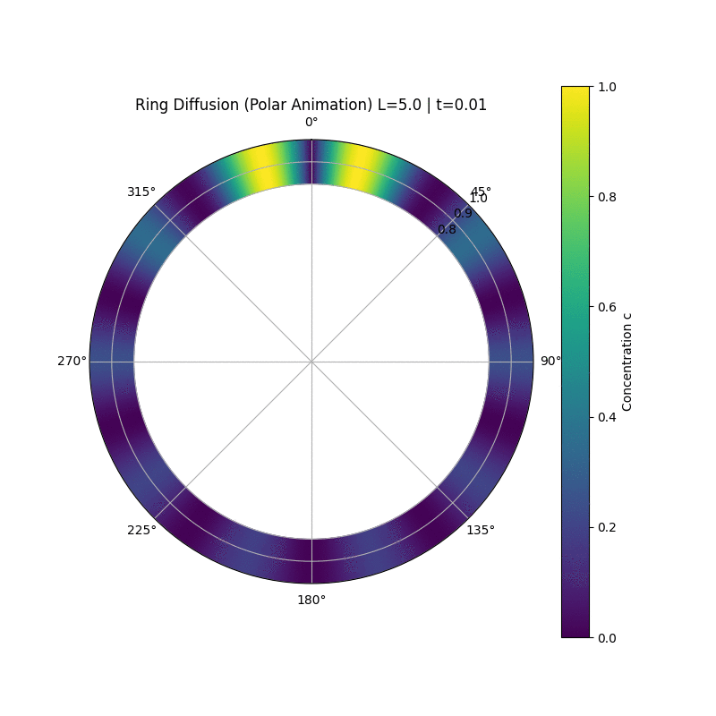
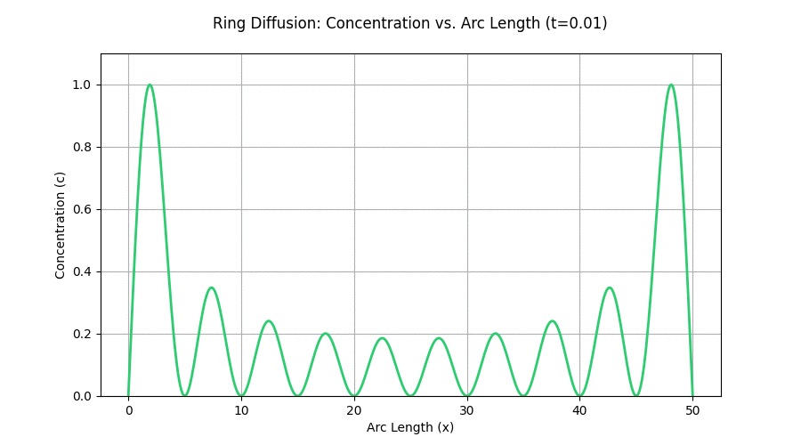

# stochastic-diffusion-simulator
A Python-based stochastic simulator for heat and particle diffusion in complex geometries (Wedges and Rings). Features analytical solutions, numerical modeling via Google Colab, and automated visual exports (.mp4/.gif).

# Stochastic Diffusion Simulator: Wedges & Rings

A high-performance stochastic simulator to model heat and particle diffusion in complex geometries. This project bridges theoretical physics with numerical modeling, providing visual and analytical insights into diffusion processes.

## 📺 Live Simulations

Below are the visual results of the stochastic diffusion process. The animations show how probability density evolves over time in different geometries.

### 📐 Wedge Diffusion
*Absorption and dispersion within a fixed angle.*

### 🟢 Ring Diffusion (Polar View)
*Periodic boundary conditions in a circular domain.*

### 📈 Cartesian Analysis
*Linear representation of the concentration evolution.*

## 🚀 Quick Access
* **Interactive Code:** [Open in Google Colab](https://colab.research.google.com/drive/15l8qwfbsedoGXcBStuctSXT2Py14anlr?usp=sharing)
* **Detailed Theory:** `Theory_Stochastic_Diffusion.pdf` (Included in this report)

## 🧠 Mathematical Background
The project solves the **Fokker-Planck Equation** (Diffusion Equation) for two specific cases:

## 1. The Wedge Geometry (Dirichlet Boundaries)
The diffusion process is modeled using the Heat Equation in polar coordinates $(r, \theta)$. For a wedge of angle $\alpha$, we solve:
$$\frac{\partial P}{\partial t} = D \nabla^2 P$$
Using separation of variables, the solution involves **Bessel Functions** of the first kind $J_\nu(kr)$, where the order $\nu$ is determined by the boundary conditions:
$$\nu = \frac{n\pi}{\alpha}$$

## 2. The Ring Geometry (Periodic Boundaries)
For a ring of circumference $L$, we apply periodic boundary conditions $P(x, t) = P(x+L, t)$. The solution converges to a **uniform distribution** (steady state) as $t \to \infty$, characterized by the Fourier series expansion of the initial concentration.

## 🛠️ Features
* **Flexible Parameters:** Easily adjust the ring radius or wedge angle.
* **Automated Visualization:** Generates `.mp4` or `.gif` animations showing probability dispersion over time.
* **Analytical Validation:** Compares numerical results with the theoretical series solutions derived in the documentation.

## 📁 Repository Structure
* `/simulations`: Exported animations of the diffusion process.
* `Stochastic_Diffusion.ipynb`: Python implementation (Numerical methods + Plotly/Matplotlib).
* `Theory_Stochastic_Diffusion.pdf`: Full mathematical derivation (Spanish).

## 🧰 Tech Stack
* Python (NumPy, SciPy, Matplotlib)
* Google Colab
* LaTeX (for theoretical modeling)

---
*Developed as part of a Stochastic Processes research project.*
